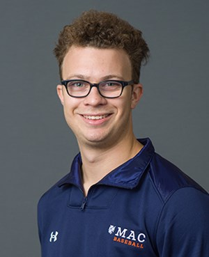

```{r setup, include=FALSE}
knitr::opts_chunk$set(echo = TRUE)
```
# Bio
My name is Will Moscato and I am a 2022 Macalester graduate with a degree in Applied Math and Statistics.
[Linkedin](https://www.linkedin.com/in/william-moscato-716708180/)
[Github](https://github.com/willmoscato?tab=repositories)
[Resume](https://docs.google.com/document/d/17tK0QK8pQ0sjOssxlcmZKS3dywJYZnXcw1z1cpmDp6o/edit?usp=sharing)


Check out my projects on the "Projects List" page in the top right corner!


```{r, echo=FALSE, out.width="50%"}

```
